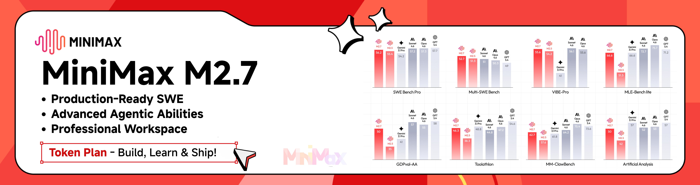

# MiniMax setup guide



MiniMax M3 can be used in CodeFleet's TypeScript multi-agent workflows with a simple provider config.

## Community offer

CodeFleet users get **12% off** the MiniMax Token Plan. Valid until **2026-06-30**.

| Region | Link |
|--------|------|
| Global | [platform.minimax.io](https://platform.minimax.io/subscribe/coding-plan?code=6ZoOY13DDV&source=link) |
| China | [platform.minimaxi.com](https://platform.minimaxi.com/subscribe/token-plan?code=98qruMqQhL&source=link) |

This is a limited-time community offer, not a paid endorsement.

## About MiniMax M3

MiniMax M3 is MiniMax's latest flagship model. It supports up to a 1M-token context window (512K guaranteed minimum) and accepts image inputs alongside text. M3 is now the recommended default; M2.7 and `MiniMax-M2.7-highspeed` remain available for callers that pin a model explicitly.

## Setup

### Environment variables

```bash
export MINIMAX_API_KEY=your-api-key
```

The adapter defaults to the global endpoint (`https://api.minimax.io/v1`). China users should override the base URL:

```bash
export MINIMAX_BASE_URL=https://api.minimaxi.com/v1
```

### Agent config

```typescript
const agent: AgentConfig = {
  name: 'my-agent',
  provider: 'minimax',
  model: 'MiniMax-M3',
  systemPrompt: 'You are a helpful assistant.',
}
```

Full example:

```typescript
import { CodeFleet, type AgentConfig } from '@codefleet/core'

const agent: AgentConfig = {
  name: 'analyst',
  provider: 'minimax',
  model: 'MiniMax-M3',
  systemPrompt: 'Analyze data and produce concise reports.',
  tools: ['bash', 'file_read', 'file_write'],
}

const orchestrator = new CodeFleet()
// Built-in filesystem tools default to a `<cwd>/.agent-workspace` sandbox;
// point the agent at an absolute path inside that root.
const result = await orchestrator.runAgent(
  agent,
  `Summarize the file ${process.cwd()}/.agent-workspace/report.csv`,
)
console.log(result.output)
```

## Disclosure

- This is a limited-time community offer valid through 2026-06-30.
- Listings are not paid endorsements.
- Some provider offers may include referral credits that help maintain the project.
